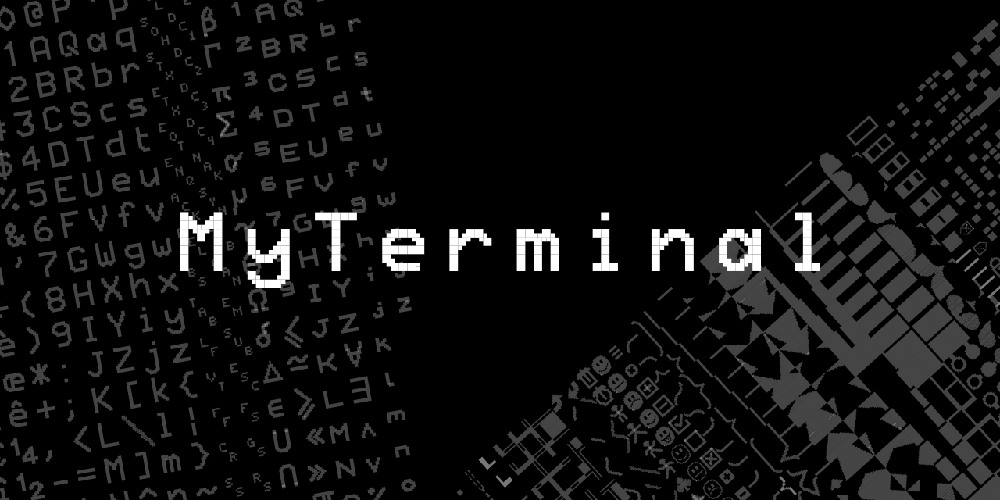

MyTerminal
==========

MyTerminal is a serial terminal implemented on an FPGA.



Characteristics
---------------

- VGA output
  - 1280×1024@60Hz,
  - 16 colors from a 512 colors/9 bits palette
  - 16×20 1024 character set
  - semi-graphic characters
- fast serial input (tested at 3 Mbps)
  - CTSRTS control signal when doing “intensive” operations
  - 8 characters FIFO 
  - ISO-8859-15 support
- low cost (cheap FPGA, 9 resistor DAC…)
- written in Verilog
- inspired by Videotex and text mode video card

Semi-graphic?
-------------

Semi-graphic is a trick used by old video chipset to mimick graphic chipset
while using only characters, thus requiring as little memory as possible.

Thomson EF9345, used notably in the Minitel, is such a video chipset.

Its physical resolution is 320×250 with a character matrix of 8×10, giving a
40×25 array of characters. It has 64 special characters which represents every
combination of a 2×3 array of pixels (2^6). These semi-graphic characters allows
to display 80×75 “pixels” with color constraints (the 2×3 pixels, as a
character, only have 2 colors available).

MyTerminal has the same set of 64 characters, thus giving a 160×153 “pixels”
graphic mode.

As each MyTerminal text cell is stored in 32 bits, it offers a “high resolution”
graphic mode of 320×255 “pixels”. Each text cell holds 20 “pixels” (4×5). These
20 “pixels” are stored in place of attributes in the text cell. Only colors
can be set while using this technique. And, again, 2 colors can be set for each
4×5 “pixels” array.

Requirements
------------

- Tang SiPeed Primer (Anlogic Eagle EG4S20BG256)
- Tang Dynasty 5.0.5
- Icarus Verilog
- Python 3
- Google Chrome if you wish to use the JavaScript demo files

Using MyTerminal as a Linux terminal
------------------------------------

If you want to use MyTerminal under Linux, you first need to install the
[MyTerminal terminfo](terminfo/myterminal.ti) file located.

This requires the `tic`, the terminfo entry-description compiler. The following
command will compile the file and install it for the current user:

```bash
tic myterminal.ti
```

Once installed, the following commands must be issued:

```bash
export TERM=myterminal
export LC_CTYPE='fr_FR.ISO-8859-15@euro'
export LANG="$LC_CTYPE"
stty -F /dev/ttyUSB0 3000000 raw
```

Note: `/dev/ttyUSB0` must be replaced with the device file attributed to
MyTerminal by your Linux OS.

Escape codes (from host to terminal)
------------------------------------

| Code (hexa)   | Function                                                    |
| ------------- |-------------------------------------------------------------|
| 01 21         | Clear entire screen, move cursor to top left position       |
| 01 28         | Clear end of current line                                   |
| 01 29         | Clear beginning of current line                             |
| 01 2A         | Clear end of screen                                         |
| 01 2B         | Clear beginning of screen                                   |
| 01 2D         | Clear current line                                          |
| 01 30+n       | Clear the n characters to the right of the current position |
|               |                                                             |
| 02 40+n       | Set foreground color (0≤n<16)                               |
| 02 50+n       | Set background color (0≤n<16)                               |
|               |                                                             |
| 03 44+n       | Use pattern n with an `and` logical function                |
| 03 45+n       | Use pattern n with an `or` logical function                 |
| 03 46+n       | Use pattern n with an `xor` logical function                |
| 03 47+n       | Use border n                                                |
|               |                                                             |
| 04 30+y 30+x  | Move cursor absolute position (x, y) 0≤x<80, 0≤y<51         |
| 04 23 30+x    | Move cursor to column x, 0≤x<80                             |
| 04 30+y 23    | Move cursor to row y, 0≤y<51                                |
|               |                                                             |
| 05 2A         | Reset attributes to default                                 |
| 05 30         | Set normal size                                             |
| 05 31         | Set double width                                            |
| 05 32         | Set double height                                           |
| 05 33         | Set double size                                             |
| 05 42         | Enable blinking                                             |
| 05 48         | Enable highlight                                            |
| 05 52         | Enable reverse video                                        |
| 05 55         | Enable underline                                            |
| 05 62         | Disable blinking                                            |
| 05 68         | Disable highlight                                           |
| 05 72         | Disable reverse video                                       |
| 05 75         | Disable underline                                           |
|               |                                                             |
| 06 43         | Show text cursor                                            |
| 06 63         | Hide text cursor                                            |
| 06 64         | Set text orientation from top to bottom (no auto-scroll)    |
| 06 6c         | Set text orientation from right to left                     |
| 06 72         | Set text orientation from left to right                     |
| 06 75         | Set text orientation from bottom to top (no auto-scroll)    |
|               |                                                             |
| 08 20+a       | Select attributes to apply when using 1A sequence code (*)  |
|               |                                                             |
| 0B            | Scroll screen up (does not move cursor)                     |
| 0C            | Scroll screen down (does not move cursor)                   |
|               |                                                             |
| 0E            | Move cursor up                                              |
| 0F            | Move cursor down                                            |
| 10            | Move cursor left                                            |
| 11            | Move cursor right                                           |
|               |                                                             |
| 12 20+n       | Repeat last character n times                               |
|               |                                                             |
| 13            | Use character page 0, see [charpage.pdf](font/charpage.pdf) |
| 14            | Use character page 1, see [charpage.pdf](font/charpage.pdf) |
| 15            | Use character page 2, see [charpage.pdf](font/charpage.pdf) |
| 16            | Use character page 3, see [charpage.pdf](font/charpage.pdf) |
| 17            | Use character page 4, see [charpage.pdf](font/charpage.pdf) |
|               |                                                             |
| 18            | Use hi-res graphics                                         |
|               |                                                             |
| 19 30         | Mouse cursor default          |
| 19 31         | Mouse cursor pointer          |
| 19 32         | Mouse cursor not allowed  |
| 19 33         | Mouse cursor wait                |
| 19 34         | Mouse cursor move                |
| 19 35         | Mouse cursor grab                |
| 19 36         | Mouse cursor crosshair      |
| 19 37         | Mouse cursor cell                |
| 19 40         | Hide mouse cursor and disable mouse events                  |
| 19 41         | Show mouse cursor and enable mouse events                   |
|               |                                                             |
| 1A 20+n       | Apply currently selected attributes to the n next characters|

(*) `a` works as follows:

- bit 4: apply current background color
- bit 3: apply current foreground color
- bit 2: apply current pattern
- bit 1: apply current function
- bit 0: apply current blinking setting

Mouse events
------------

When mouse events are enabled (0x19, 0x41), MyTerminal sends control codes
whenever the mouse is used by the user (movements, click).

Every mouse events is composed of 4 bytes starting with 0x1e.

    0x1e 0x80+mouse_x 0x80+mouse_y 0x80+modifiers

Modifiers works as follows:

- bit 7: always 1
- bit 6: meta key is pressed
- bit 5: alt key is pressed
- bit 4: ctrl key is pressed
- bit 3: shift key is pressed
- bit 2: middle button is pressed
- bit 1: right button is pressed
- bit 0: left button is pressed

Notes
-----

This is work in progress!